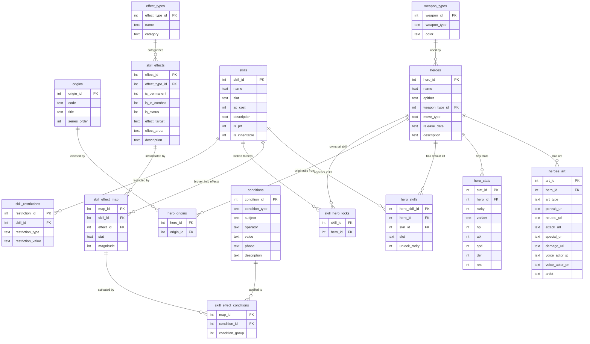

# Database Overview

High-level map of how all tables relate. Grouped by concern.

---

## Groups

| Load Order | Group | Tables | File |
|---|---|---|---|
| 1 | General Lookups | `weapon_types`, `origins` | general.schema.sql |
| 2 | Hero Catalog | `heroes`, `heroes_art`, `hero_stats` | heroes.schema.sql |
| 3 | Skill Catalog | `effect_types`, `skill_effects`, `skills`, `conditions`, `skill_effect_map`, `skill_effect_conditions`, `skill_restrictions` | skills.schema.sql |
| 4 | Junctions | `hero_origins`, `hero_skills`, `skill_hero_locks` | junctions.schema.sql |
| — | Barracks | *(planned)* | barracks.schema.sql |

---

## Full ERD



---

## How to read a skill

A `skill` is broken into rows in `skill_effect_map` — one row per stat per effect.
Each of those rows optionally links to one or more `conditions` via `skill_effect_conditions`.

```
skills
  └── skill_effect_map  ← one row per effect per stat (e.g. Atk+9, Spd+9)
        ├── skill_effects   ← what the effect IS (stat boost, in combat, targets unit)
        │     └── effect_types  ← broad category (stat, combat, movement…)
        └── skill_effect_conditions  ← when it activates
              └── conditions  ← reusable conditions (HP >= 50%, partner deployed…)
```

Conditions in the same `condition_group` are **OR**'d.
Different `condition_group` values on the same `map_id` are **AND**'d.

---

## How to read a hero

```
heroes
  ├── weapon_types     ← color + weapon category (e.g. Red Sword)
  ├── hero_origins     ← which FE games the hero comes from (many-to-many)
  ├── heroes_art       ← one row per art set (Standard, Resplendent, Removed)
  ├── hero_stats       ← one row per rarity × variant (Flaw / Neutral / Asset)
  └── hero_skills      ← one row per skill, with the rarity it unlocks at
        └── skills     ← links into the full skill catalog
```
