# Database Overview

High-level map of how all tables relate. Grouped by concern.

For feature-level documentation with design reasoning and query patterns, see:

- [Heroes](../features/heroes.md) — characters, alts, stats, art, origins, duo skills
- [Skills](../features/skills.md) — skill catalog, effects, conditions, restrictions, default kits
- [Hero Types](../features/hero-types.md) — Legendary/Mythic/Duo types, elements, ally boosts
- [Banners](../features/banners.md) — banner catalog, summoning pools, pool derivation queries

---

## Load Order

| Step | Group | Tables | File |
|---|---|---|---|
| 1 | General Lookups | `weapon_types`, `origins` | general.schema.sql |
| 2 | Characters & Heroes | `characters`, `heroes`, `heroes_art`, `hero_stats`, `hero_duo_skills` | heroes.schema.sql |
| 3 | Skill Catalog | `effect_types`, `skill_effects`, `skills`, `conditions`, `skill_effect_map`, `skill_effect_conditions`, `skill_move_restrictions`, `skill_weapon_restrictions` | skills.schema.sql |
| 4 | Hero Types | `hero_types`, `elements`, `type_effects`, `hero_type_effect_map` | hero_types.schema.sql |
| 5 | Junctions | `hero_origins`, `hero_skills`, `skill_hero_locks`, `hero_relations`, `character_relations`, `hero_type_map`, `hero_ally_boosts` | junctions.schema.sql |
| 6 | Banners | `banner_types`, `banner_type_rates`, `banners`, `banner_focus` | banners.schema.sql |
| 7 | Barracks | *(planned)* `barracks`, `barracks_skills` | barracks.schema.sql |

Each file depends only on tables defined in earlier steps. Load in order.

---

## Group Descriptions

### 1 — General Lookups
Seed tables loaded first. No foreign keys pointing into these from this file.

- **weapon_types** — every weapon category + color combo (Sword/Red, Blue Tome, etc.). Used by `heroes` and `skills`.
- **origins** — the FE games heroes come from (FE7, FE16, FEH, etc.). Used by `hero_origins`.

### 2 — Characters & Heroes
The hero catalog. `characters` must come before `heroes` since `heroes.character_id` references it.

- **characters** — one row per real person, regardless of how many hero alts they have. Canonical identity anchor.
- **heroes** — one row per hero entry (each alt is its own row). Links to `characters`, `weapon_types`.
- **heroes_art** — one row per art set per hero (Standard, Resplendent, Removed). Stores URLs and artist/VA info.
- **hero_stats** — base stats at each rarity × IV variant (Flaw / Neutral / Asset). One row per combination.

### 3 — Skill Catalog
All skill data, broken into components for queryability.

- **effect_types** — reference table of effect categories (stat, combat, damage, movement, status, special, miracle).
- **skill_effects** — the *pattern* of an effect: what kind, who it targets, what range, how it's applied. Reused across skills.
- **skills** — the catalog of every equippable skill. Weapon skills carry a `weapon_type_id` so you can query all Swords, all Blue Tomes, etc.
- **conditions** — reusable activation conditions (HP >= 50%, unit initiated, partner deployed, etc.).
- **skill_effect_map** — ties a skill to its effects, one row per stat per effect. Carries the actual value (+9, etc.).
- **skill_effect_conditions** — ties conditions to a specific skill-effect row, with OR/AND group logic.
- **skill_move_restrictions** — which move types cannot inherit a given skill. One row per (skill, move_type) pair.
- **skill_weapon_restrictions** — which weapon type + color combos cannot inherit a given skill. FKs to `weapon_types` so restrictions are precise to a specific weapon+color (e.g. Colorless Tome only). Restricting an entire weapon category requires one row per color.

### 4 — Hero Types
Special hero classifications (Legendary, Mythic, Duo, etc.) and the effects they provide.

- **hero_types** — the 12 type classifications (Legendary, Mythic, Chosen, Duo, Harmonized, Ascended, Aided, Entwined, Rearmed, Attuned, Emblem, Dance).
- **elements** — seasonal elements tied to Legendary/Chosen (Fire/Water/Wind/Earth → Arena) and Mythic (Light/Dark/Astra/Anima → Aether Raids).
- **type_effects** — catalog of effects a type provides (seasonal stat boost, arena scoring, duo skill, etc.). Shared across types where applicable.
- **hero_type_effect_map** — junction: which effects does each type have? (e.g. Legendary → seasonal_stat_boost, ally_stat_boost, arena_scoring)
- **hero_duo_skills** — the Duo or Harmonized skill for a specific hero entry. Not an equippable skill — it cannot be inherited and lives outside the normal skill slots.

### 6 — Banners
Summoning banner catalog and focus lineups. Depends on heroes.

- **banner_types** — lookup table of valid banner type identifiers. Single source of truth — both `banners` and `banner_type_rates` FK into this, so adding a new type is one INSERT here.
- **banner_type_rates** — base pull rates per (banner_type, pool_tier). Seed data for all banner types.
- **banners** — one row per banner event. Carries type, date range, game version (major×100+minor), spark count, and an optional `source_banner_id` FK for reruns.
- **banner_focus** — which heroes are focus units on a given banner. `has_4star_focus` flag marks heroes that also appear in the 4★ focus pool.

Pool derivation uses `availability`, `debut_version`, `pool_4star_special_version`, and `pool_3_4star_version` on the `heroes` table. Pass `banner.game_version` as a query parameter to reconstruct any historical pool.

### 7 — Barracks
*(planned)* Player's personal hero collection.

---

### 5 — Junctions
All cross-file junction tables. Loaded last because they reference tables across all prior files.

- **hero_origins** — which FE games a hero comes from. Many-to-many. Harmonized heroes have two origins.
- **hero_skills** — a hero's default skill kit, with the slot and unlock rarity for each skill.
- **skill_hero_locks** — links a prf skill to the hero(es) it belongs to.
- **hero_relations** — links a specific Duo/Harmonized hero entry to the companion *character(s)* featured with them. Hero-side is `hero_id` (specific alt); companion-side is `character_id` (any alt of that character).
- **character_relations** — named relationships between characters (not hero entries): `parallel` (designed as echoes, e.g. Tharja ↔ Rhajat), `name_shared` (same name, unrelated people, e.g. Hilda FE5 ↔ Hilda FE16), `possession` (one inhabits/controls the other, e.g. Robin ↔ Grima). Symmetric — store one row, query both directions.
- **hero_type_map** — links a hero entry to its special type(s). Carries per-hero type data: element, duel value, pair-up flag. A hero can have multiple types (e.g. Legendary Duo has both rows).
- **hero_ally_boosts** — the stat boosts a Legendary or Mythic hero grants to allies during their active season. One row per stat per `hero_type_map` entry.

---

## Full ERD

```mermaid
erDiagram

    %% -------------------------
    %% GENERAL LOOKUPS
    %% -------------------------

    weapon_types {
        int  weapon_type_id PK
        text weapon_type
        text color
    }

    origins {
        int  origin_id    PK
        text code
        text title
        int  series_order
    }

    %% -------------------------
    %% CHARACTERS & HEROES
    %% -------------------------

    characters {
        int  character_id   PK
        text canonical_name
        text description
    }

    heroes {
        int  hero_id                    PK
        int  character_id               FK
        text name
        text epithet
        int  weapon_type_id             FK
        text move_type
        text release_date
        text description
        text availability
        int  debut_version
        int  pool_4star_special_version
        int  pool_3_4star_version
    }

    heroes_art {
        int  art_id         PK
        int  hero_id        FK
        text art_type
        text portrait_url
        text neutral_url
        text attack_url
        text special_url
        text damage_url
        text voice_actor_jp
        text voice_actor_en
        text artist
    }

    hero_stats {
        int  stat_id  PK
        int  hero_id  FK
        int  rarity
        text variant
        int  hp
        int  atk
        int  spd
        int  def
        int  res
    }

    %% -------------------------
    %% SKILL CATALOG
    %% -------------------------

    effect_types {
        int  effect_type_id PK
        text name
        text category
    }

    skill_effects {
        int  skill_effect_id PK
        int  effect_type_id  FK
        int  is_permanent
        int  is_in_combat
        int  is_status
        text effect_target
        text effect_area
        text description
    }

    skills {
        int  skill_id       PK
        text name
        text slot
        int  weapon_type_id FK
        int  sp_cost
        text description
        int  is_prf
        int  is_inheritable
    }

    conditions {
        int  condition_id   PK
        text condition_type
        text subject
        text operator
        text value
        text phase
        text description
    }

    skill_effect_map {
        int  skill_effect_map_id PK
        int  skill_id            FK
        int  skill_effect_id     FK
        text stat
        int  magnitude
    }

    skill_effect_conditions {
        int sec_id              PK
        int skill_effect_map_id FK
        int condition_id        FK
        int condition_group
    }

    skill_move_restrictions {
        int  skill_id  FK
        text move_type
    }

    skill_weapon_restrictions {
        int skill_id       FK
        int weapon_type_id FK
    }

    hero_duo_skills {
        int  duo_skill_id PK
        int  hero_id      FK
        text name
        text description
    }

    %% -------------------------
    %% HERO TYPES
    %% -------------------------

    hero_types {
        int  hero_type_id PK
        text name
        text description
    }

    elements {
        int  element_id    PK
        text name
        text game_mode
        text element_group
    }

    type_effects {
        int  type_effect_id PK
        text name
        text category
        int  is_seasonal
        text game_mode
        text description
    }

    hero_type_effect_map {
        int hero_type_id   FK
        int type_effect_id FK
    }

    %% -------------------------
    %% BANNERS
    %% -------------------------

    banner_types {
        text banner_type PK
    }

    banner_type_rates {
        text banner_type FK
        text pool_tier   PK
        real base_rate
    }

    banners {
        int  banner_id        PK
        text name
        text banner_type      FK
        text start_date
        text end_date
        int  game_version
        int  spark_count
        int  source_banner_id FK
    }

    banner_focus {
        int banner_id       FK
        int hero_id         FK
        int has_4star_focus
    }

    %% -------------------------
    %% JUNCTIONS
    %% -------------------------

    hero_origins {
        int hero_id   FK
        int origin_id FK
    }

    hero_skills {
        int  hero_skill_id PK
        int  hero_id       FK
        int  skill_id      FK
        text slot
        int  unlock_rarity
    }

    skill_hero_locks {
        int skill_id FK
        int hero_id  FK
    }

    hero_relations {
        int  relation_id   PK
        int  hero_id       FK
        int  character_id  FK
        text relation_type
    }

    character_relations {
        int  char_relation_id     PK
        int  character_id         FK
        int  related_character_id FK
        text relation_type
    }

    hero_type_map {
        int hero_type_map_id PK
        int hero_id          FK
        int hero_type_id     FK
        int element_id       FK
        int duel_value
        int has_pair_up
    }

    hero_ally_boosts {
        int  boost_id         PK
        int  hero_type_map_id FK
        text stat
        int  magnitude
    }

    %% -------------------------
    %% RELATIONSHIPS
    %% -------------------------

    banner_types     ||--o{ banners              : "type of"
    banner_types     ||--o{ banner_type_rates    : "has rates"
    banners          ||--o{ banner_focus         : "features"
    heroes           ||--o{ banner_focus         : "featured in"
    banners          |o--o| banners              : "reruns"

    characters       ||--o{ heroes              : "has alts"
    characters       ||--o{ hero_relations      : "is companion in"
    characters       ||--o{ character_relations : "has relation"

    weapon_types     ||--o{ heroes                   : "used by"
    weapon_types     ||--o{ skills                   : "weapon type of"
    weapon_types     ||--o{ skill_weapon_restrictions : "restricts"

    origins          ||--o{ hero_origins        : "claimed by"

    heroes           ||--o{ heroes_art          : "has art"
    heroes           ||--o{ hero_stats          : "has stats"
    heroes           ||--o{ hero_origins        : "originates from"
    heroes           ||--o{ hero_skills         : "has default kit"
    heroes           ||--o{ skill_hero_locks    : "owns prf"
    heroes           ||--o{ hero_relations      : "has companions"
    heroes           ||--o{ hero_type_map       : "has type"
    heroes           ||--o| hero_duo_skills     : "has duo/harmonized skill"

    hero_types       ||--o{ hero_type_effect_map : "has effects"
    hero_types       ||--o{ hero_type_map        : "assigned to hero"
    type_effects     ||--o{ hero_type_effect_map : "applied to type"
    elements         ||--o{ hero_type_map        : "element of"
    hero_type_map    ||--o{ hero_ally_boosts     : "grants boost"

    skills           ||--o{ hero_skills               : "in kit"
    skills           ||--o{ skill_effect_map          : "broken into effects"
    skills           ||--o{ skill_hero_locks          : "locked to hero"
    skills           ||--o{ skill_move_restrictions   : "restricted by move"
    skills           ||--o{ skill_weapon_restrictions : "restricted by weapon"

    effect_types     ||--o{ skill_effects        : "categorizes"
    skill_effects    ||--o{ skill_effect_map     : "instantiated by"
    skill_effect_map ||--o{ skill_effect_conditions : "activated by"
    conditions       ||--o{ skill_effect_conditions : "applied to"
```



---

## How to read a character

```
characters  ← one row per real person (canonical identity)
  └── heroes  ← every alt/entry for this character shares character_id
        ├── heroes_art    ← art per alt (Standard, Resplendent, Removed)
        ├── hero_stats    ← stats per rarity × IV variant
        ├── hero_origins  ← which FE games this alt comes from
        ├── hero_skills   ← default kit for this alt
        └── hero_type_map ← special type(s) for this alt (Legendary, Duo, etc.)
```

Character-level relationships (apply to all alts automatically):
```
characters
  ├── character_relations  ← parallel / name_shared / possession links
  └── hero_relations       ← hero_id (specific alt) → character (companion)
                              e.g. "Duo Palla" links to Est and Catria as characters
```

---

## How to read a banner

```
banners
  ├── banner_type_rates  ← base rates for this banner's type (keyed on banner_type)
  ├── banner_focus       ← focus heroes; has_4star_focus=1 marks 4★ focus units
  └── source_banner_id   ← points to the original banner if this is a rerun

Pool derivation — pass banner.game_version (V) into these queries:
  5★ focus:        banner_focus WHERE banner_id = X
  5★ off-focus:    heroes WHERE availability = '5star_exclusive' AND debut_version < V
  4★ focus:        banner_focus WHERE banner_id = X AND has_4star_focus = 1
  4★ special:      heroes WHERE pool_4star_special_version <= V
                              AND (pool_3_4star_version IS NULL OR pool_3_4star_version > V)
  3-4★ standard:   heroes WHERE pool_3_4star_version <= V
                   (launch-3-4★ heroes: set pool_3_4star_version = debut_version, not NULL)
```

---

## How to read a hero type

```
hero_types  ← Legendary, Mythic, Duo, etc.
  └── hero_type_effect_map
        └── type_effects  ← what ALL heroes of this type get (seasonal boost, duo skill, etc.)

hero_type_map  ← per-hero type assignment
  ├── hero_types  ← which type
  ├── elements    ← which seasonal element (Fire, Astra, etc.) — Legendary/Mythic/Chosen only
  └── hero_ally_boosts  ← per-stat ally boosts for this hero (HP+3, Atk+2, etc.)

hero_duo_skills  ← the Duo or Harmonized button skill (not an equippable slot)
```

---

## How to read a skill

```
skills
  ├── weapon_type_id          ← weapon skills only: Sword, Blue Tome, Green Dagger, etc.
  ├── skill_move_restrictions   ← which move types cannot inherit (Infantry, Cavalry, etc.)
  ├── skill_weapon_restrictions ← which weapon+color combos cannot inherit (FK to weapon_types)
  ├── skill_hero_locks          ← prf skills: which hero(es) own it
  └── skill_effect_map          ← one row per stat per effect (Atk+9, Spd+9 = two rows)
        ├── skill_effects     ← what the effect IS (pattern: stat boost, in combat, targets unit)
        │     └── effect_types  ← broad category (stat, combat, damage, movement…)
        └── skill_effect_conditions  ← when it activates
              └── conditions   ← reusable conditions (HP >= 50%, partner deployed…)
```

Conditions in the same `condition_group` are **OR**'d.
Different `condition_group` values on the same `map_id` are **AND**'d.
